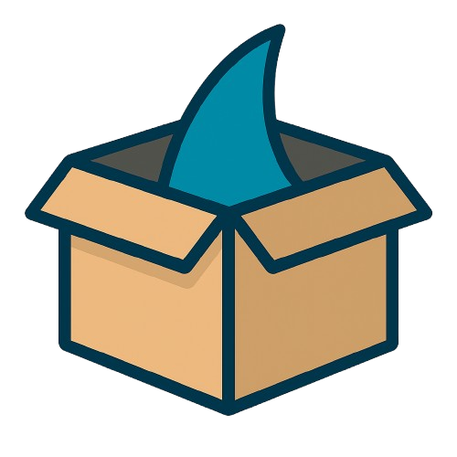

<p align="center">
  <picture>
    <source media="(prefers-color-scheme: dark)" srcset="ui/img/name-white.png">
    
  </picture>
</p>

<p align="center">
  <b>The Jellyfin show-tracking companion app.</b><br>
  See which episodes are missing from your shows, and what's airing next.
</p>

<p align="center">
  <a href="https://github.com/rileyc313/finventory/releases/latest"></a>
  
  
</p>

## What it does

- **Missing episodes.** Every show on your Jellyfin server, with a badge for how many aired episodes you don't have. Open a show to see exactly which ones, season by season.
- **Upcoming episodes.** Announced episodes for the shows you have, grouped by day.
- **Shows split across drives** count as one show, and files holding two episodes (S01E01-E02) count as both.
- **Dark and light themes.**

## Install

1. Download `Finventory.exe` from the [latest release](https://github.com/rileyc313/finventory/releases/latest).
2. Run it. Windows may say "Windows protected your PC" because the app isn't signed: click **More info**, then **Run anyway**.
3. Right-click it on the taskbar and choose **Pin to taskbar**.

Nothing else to install. Windows 10 and 11 already have everything it needs.

## Getting started

1. In Jellyfin, open **Dashboard → API Keys** and add one called Finventory. You need to be the server's admin.
2. In Finventory, open **Settings** and enter your server address (like `http://192.168.1.10:8096`) and that key. They're saved on your computer, so you only do this once.
3. Optional: add a free [TMDB](https://www.themoviedb.org/settings/api) API key for shows TVmaze doesn't have.
4. Press **Scan library**. The first scan takes a few minutes; later scans reuse earlier matches.

## How it works

Finventory reads your library from the Jellyfin API, then matches each show to an episode list, exact IDs first:

1. TVmaze by TVDB or IMDb ID
2. TMDB by TMDB ID, when you've added a key
3. TVmaze by name, flagged in the app since it can pick the wrong show

Results are saved in the app, so it opens instantly with your last scan.

## Building from source

Finventory is a [Tauri 2](https://tauri.app) window around `ui/index.html`, which does all the work. Building needs [Rust](https://rustup.rs):

```
cargo build --release
```

The app is `target/release/finventory.exe`.

## Credits

Show data from [TVmaze](https://www.tvmaze.com) and [TMDB](https://www.themoviedb.org). This product uses the TMDB API but is not endorsed or certified by TMDB.

<p align="center">
  <picture>
    <source media="(prefers-color-scheme: dark)" srcset="ui/img/box-dark.png">
    
  </picture>
</p>
